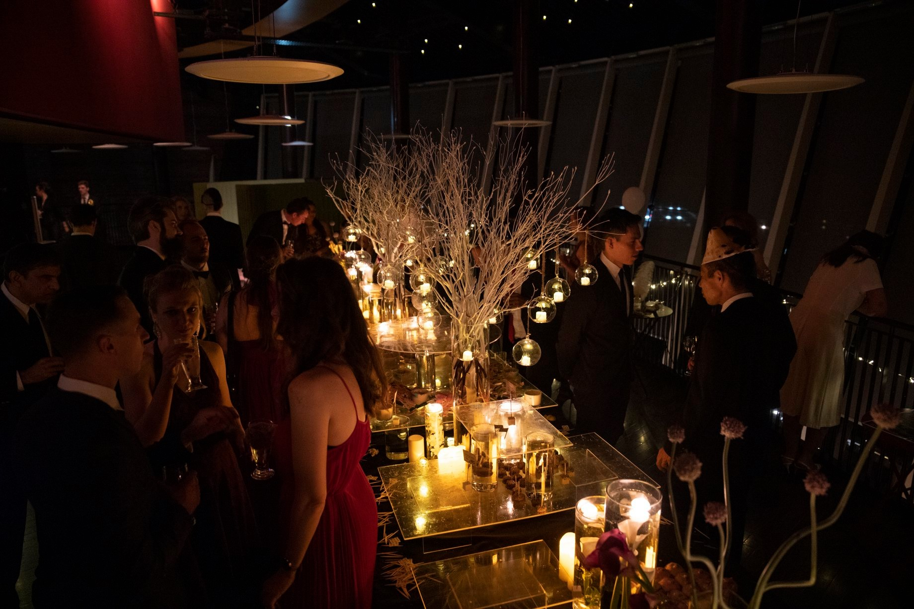
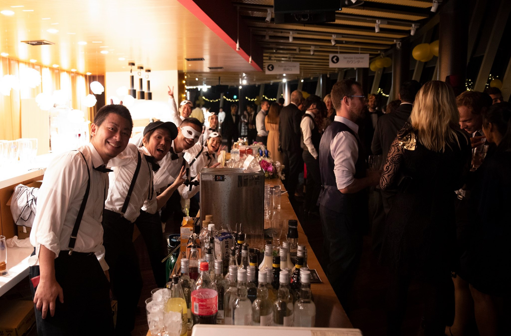
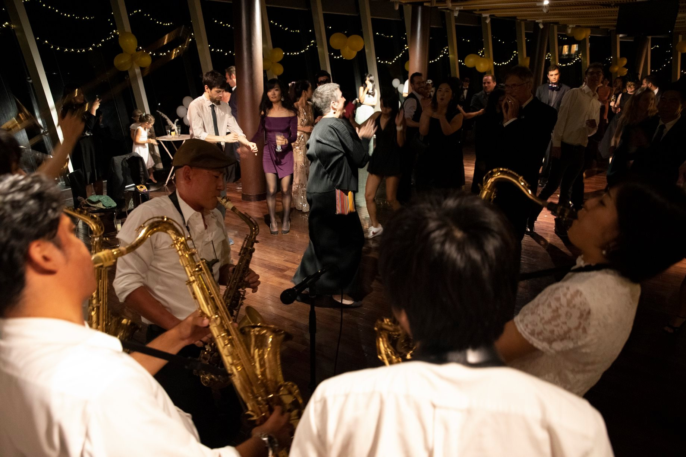
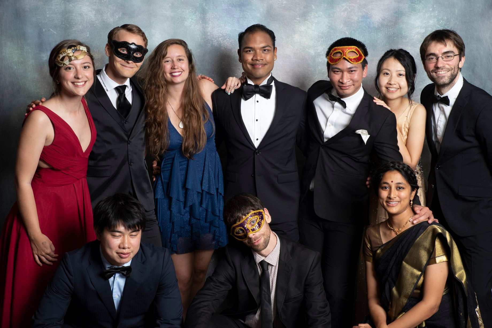
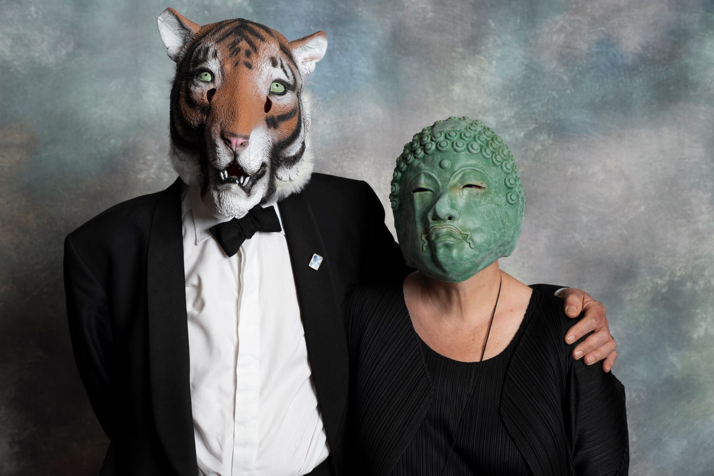

<big>The biggest event of the year! Join us for the  annual celebration of the OIST graduates.</big>


```{=html}
<div class="countdown-container">
  <div class="countdown-title">🎵 Event Schedule</div>
  <div class="schedule-content">
    <div class="schedule-item">
      <div class="schedule-time">19:30 - 20:00</div>
      <div class="schedule-event">🚪 Doors Open</div>
    </div>
    <div class="schedule-item">
      <div class="schedule-time">20:00 - 21:00</div>
      <div class="schedule-event">🎤 Andrew & Fr.</div>
    </div>
    <div class="schedule-item">
      <div class="schedule-time">21:00 - 22:00</div>
      <div class="schedule-event">🎶 MOJO</div>
    </div>
    <div class="schedule-item">
      <div class="schedule-time">22:00 - 23:00</div>
      <div class="schedule-event">🎧 OIST Party Music</div>
    </div>
    <div class="schedule-item">
      <div class="schedule-time">23:00 - 01:00</div>
      <div class="schedule-event">🎧 DJ Skeezy</div>
    </div>
    <div class="schedule-item">
      <div class="schedule-time">01:00 - ... </div>
      <div class="schedule-event">🎧 surface element & temma</div>
    </div>
  </div>
</div>

<script>
  // Apply gradient style to schedule container
  const scheduleElement = document.querySelector('.countdown-container');
  scheduleElement.style.background = 'linear-gradient(135deg, #667eea 0%, #764ba2 100%)';
</script>

<div class="progress-container">
  <div class="progress-title">🎟️ Tickets Sold Out</div>
  <div>All tickets are now sold out and won't be available at the door. We kindly ask those without tickets to refrain from the event area.</div>
</div>

```

```{=html}
<div class="three-column-layout">
```


::: section-container

## 📋 Event Details
🗓️ 2026 Feb 27<sup>th</sup> Fri  
🕗 20:00 - late (doors open at 19:30)  
📍 OIST Center Building 

🤵 Cocktail Attire or National Dress  
🎟️ ¥5,000 (food, drinks, and more)
:::


::: section-container

## 🎰 Raffle
If you bought a ticket by February 20th, you may win:

🏨 Stay at Miyuki Beach Hotel <a href="https://www.instagram.com/hotelmiyukibeach_official"></a>  
🏨 Stay at Rizzan Sea-Park Hotel <a href="https://www.instagram.com/rizzan.sea.park.hotel_resort"></a>   
🍽️ Dinner for two at Rizzan  
🍽️ Lunch for two at Rizzan  

:::

::: section-container

## 🍾 Catering

🍹 All-you-can-drink by Lab0  
🍽️ Finger foods by Caesar's Kitchen

Detailed menu to be announced soon.
:::

::: section-container-featured

## 🎉 Entertainment

🎸 Andrew and Fr. <a href="https://www.instagram.com/andrew.and.fr"></a>   
🎷 Modern Jazz Orchestra (MOJO) <a href="https://www.instagram.com/ryudaimojo"></a>   
🎧 DJ Skeezy <a href="https://www.instagram.com/djskeezy"></a>  
🎤 Karaoke room  
📸 Photo booth

<div style="margin-top: 0rem; text-align: center;">
  <a href="https://docs.google.com/forms/d/e/1FAIpQLSe2PkEh-1hkkLCPvtuqnmW8X_oaC6pf5aYe-oFfWaUqHp_BIA/viewform" style="display: inline-block; padding: 0.75rem 1.5rem; background: linear-gradient(135deg, #667eea 0%, #764ba2 100%); color: white; text-decoration: none; border-radius: 8px; font-weight: 600; transition: transform 0.2s;">
    🎵 Suggest Your Song
  </a>
</div>
:::


```{=html}
</div>
```


## OIST Graduation Ball 2019
This year will be the first time the Graduation Ball will be held on campus since 2019.

```{=html}
<div style="max-width: 800px; margin: 0 auto;" id="photo-gallery">
<div class="gallery-container" style="max-width: 100%;">
  <div class="gallery-wrapper">
    
    
    
    
    
</div>
  <button class="gallery-nav gallery-prev" onclick="changeGalleryImage(-1)">❮</button>
  <button class="gallery-nav gallery-next" onclick="changeGalleryImage(1)">❯</button>
  <div class="gallery-dots">
    <span class="dot active" onclick="currentGalleryImage(0)"></span>
    <span class="dot" onclick="currentGalleryImage(1)"></span>
    <span class="dot" onclick="currentGalleryImage(2)"></span>
    <span class="dot" onclick="currentGalleryImage(3)"></span>
    <span class="dot" onclick="currentGalleryImage(4)"></span>
  </div>
</div>
</div>

<script>
let galleryIndex = 0;
let galleryTimer;

function changeGalleryImage(n) {
  clearTimeout(galleryTimer);
  galleryIndex += n;
  const galleryImages = document.querySelectorAll('#photo-gallery .gallery-image');
  if (galleryIndex >= galleryImages.length) {
    galleryIndex = 0;
  }
  if (galleryIndex < 0) {
    galleryIndex = galleryImages.length - 1;
  }
  displayGalleryImage();
  autoGallery();
}

function currentGalleryImage(n) {
  clearTimeout(galleryTimer);
  galleryIndex = n;
  displayGalleryImage();
  autoGallery();
}

function displayGalleryImage() {
  const galleryImages = document.querySelectorAll('#photo-gallery .gallery-image');
  const galleryDots = document.querySelectorAll('#photo-gallery .dot');
  
  galleryImages.forEach(img => img.style.display = 'none');
  galleryImages[galleryIndex].style.display = 'block';
  
  galleryDots.forEach(dot => dot.classList.remove('active'));
  galleryDots[galleryIndex].classList.add('active');
}

function autoGallery() {
  galleryTimer = setTimeout(() => {
    galleryIndex++;
    const galleryImages = document.querySelectorAll('#photo-gallery .gallery-image');
    if (galleryIndex >= galleryImages.length) {
      galleryIndex = 0;
    }
    displayGalleryImage();
    autoGallery();
  }, 4000);
}

// Initialize gallery
displayGalleryImage();
autoGallery();
</script>
```


::: section-container-featured

## ⚠️ Safe Space Policy

All participants are expected to contribute to a **safe and respectful environment**. This event is a safe space for women and the LGBTQIA+ community. 

**We have a zero tolerance policy towards harassment of any kind** on the basis of gender, sexuality, race, outfit choice, or any other characteristic.

Harassment, discrimination, or offensive behavior are not tolerated. Individuals who violate these expectations may be asked to leave and will be subjected to OIST anti-harassment policies.

:::

## ℹ️ FAQs

**Where exactly is the event?**  
Different locations within the OIST Center Building. The main event will be held in Caesar's Kitchen.

**I am graduating. Do I need to get a ticket?**  
No, graduates get free entry. Please email us at [graduationball@oist.jp](mailto:graduationball@oist.jp).

**How do I check in on the day of the event?** 
If you purchased your ticket, you should’ve received an individual QR code that will be scanned on the day of the event. If you haven’t received it yet, contact [graduationball@oist.jp](mailto:graduationball@oist.jp).

**Guest parking?**  
OIST's main parking building is available for use.

**Can I bring a guest?**  
Yes, but they will need to purchase a ticket for them.


::: section-container-sponsors
## 🙏 Sponsors

```{=html}
<div style="max-width: 800px; margin: 0 auto;">
<div class="gallery-container" style="max-width: 100%;">
  <div class="gallery-wrapper">
    
    
    
    
  </div>
  <button class="gallery-nav gallery-prev" onclick="changeSponsorImage(-1)">❮</button>
  <button class="gallery-nav gallery-next" onclick="changeSponsorImage(1)">❯</button>
  <div class="gallery-dots">
    <span class="dot active" onclick="currentSponsorImage(0)"></span>
    <span class="dot" onclick="currentSponsorImage(1)"></span>
    <span class="dot" onclick="currentSponsorImage(2)"></span>
    <span class="dot" onclick="currentSponsorImage(3)"></span>
  </div>
</div>
</div>

<script>
let sponsorIndex = 0;
let sponsorTimer;

function changeSponsorImage(n) {
  clearTimeout(sponsorTimer);
  sponsorIndex += n;
  const sponsorImages = document.querySelectorAll('.section-container-sponsors .gallery-image');
  if (sponsorIndex >= sponsorImages.length) {
    sponsorIndex = 0;
  }
  if (sponsorIndex < 0) {
    sponsorIndex = sponsorImages.length - 1;
  }
  displaySponsorImage();
  autoSponsor();
}

function currentSponsorImage(n) {
  clearTimeout(sponsorTimer);
  sponsorIndex = n;
  displaySponsorImage();
  autoSponsor();
}

function displaySponsorImage() {
  const sponsorImages = document.querySelectorAll('.section-container-sponsors .gallery-image');
  const sponsorDots = document.querySelectorAll('.section-container-sponsors .dot');
  
  sponsorImages.forEach(img => img.style.display = 'none');
  sponsorImages[sponsorIndex].style.display = 'block';
  
  sponsorDots.forEach(dot => dot.classList.remove('active'));
  sponsorDots[sponsorIndex].classList.add('active');
}

function autoSponsor() {
  sponsorTimer = setTimeout(() => {
    sponsorIndex++;
    const sponsorImages = document.querySelectorAll('.section-container-sponsors .gallery-image');
    if (sponsorIndex >= sponsorImages.length) {
      sponsorIndex = 0;
    }
    displaySponsorImage();
    autoSponsor();
  }, 4000);
}

// Initialize sponsor gallery
displaySponsorImage();
autoSponsor();
</script>
```

:::

::: section-container
## 💝 Donors

We would like to thank our OIST community. Every donation, big or small, helps us make this night unforgettable for our graduates.

Amedeo Roberto Esposito, Amy Shen, Daniel Mueller, Dyon van Dinter, Gaspar Sanchez, Hideaki Kawai, Hugo Hoedemaker, Isaku Higa, Jamie Sanderson, Jamila Rodrigues, Julio Barros, Kacper Nowak, Kenji Doya, Lilian Magnus, Okay Cem, Pinaki Chakraborty, Samuel Ross, Satoshi Mitarai, Shigeharu Kato, Shinji Narita, Simone Pigolotti, Tom Froese, Yifan Wang, Yukiko Gouda

:::

::: section-container-contact
## 📬 Contact Us
Find us at Cafe Tancha during ticket sales or email us at [graduationball@oist.jp](mailto:graduationball@oist.jp).
:::

::: section-container-organizers
## 👩‍💼 Organizers
Alessandra De Amici, Anzhelika Koldaeva, Christian Amor Rodriguez, Diala Edde, Ian Christopher Johnson, Jann Zwahlen, Kokila Dilhani Perera, Lorena Andreoli, Maya Agata, Maya Street, Miyu Nambu, Simone Tandurella, and Xim Yue Hong.
:::